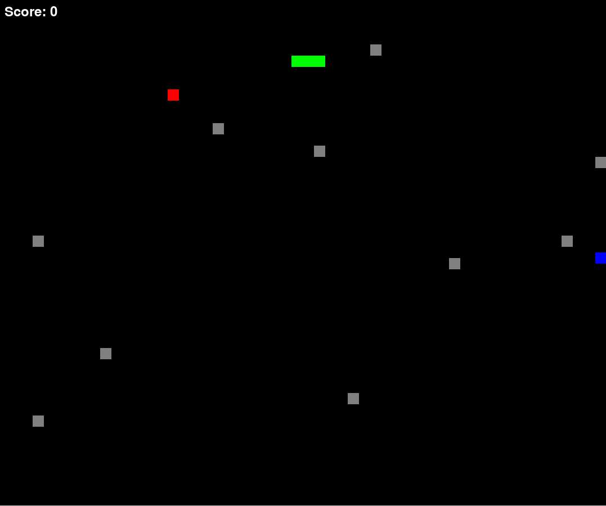

# 🐍 Snake Game

## Description

Welcome to this version of the classic Snake game, implemented in Python. Control a snake that moves around the screen, eating food to grow larger. The game ends when the snake collides with itself or with the edges of the screen.

## User Interface Screenshot




## Features

-Control the snake using the arrow keys ⬆️⬇️⬅️➡️
-Random generation of food on the screen 🍎
-Collision detection to handle snake-food and snake-snake interactions 🚫
-Score tracking 📈
-End game message and option to restart the game 🎮

## Usage

1. Clone the repository.
2. Navigate to the directory containing snake.py.
3. Run the script:
    ```bash
        snake.py

Enjoy the game!
